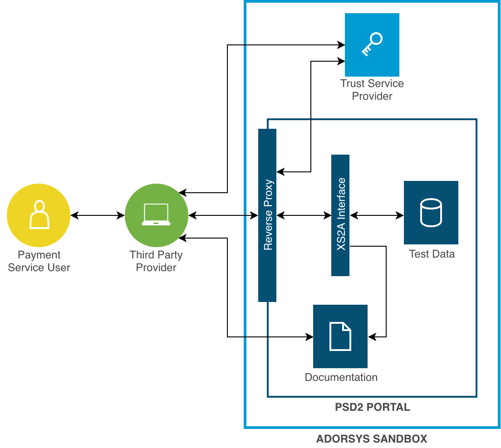

# Sandbox

The [Payment Service Directive 2 (PSD2)](https://eur-lex.europa.eu/legal-content/EN/TXT/PDF/?uri=CELEX:32015L2366&from=EN) 
instructs banks to provide a fully productive Access-to-Account (XS2A) interface to
Third Party Provider (TPPs) until September 2019. XS2A itself consists of banking services to initiate payments (PIS), 
request account data (AIS) and get the confirmation of the availability of funds (PIIS). 
In order to guarantee the compliance of this deadline due to adaptions and bugs, PSD2 claims the banks 
to provide a functional sandbox offering the XS2A services in a non-productive environment until March 2019.  

Central component of the sandbox is the XS2A interface which meets the requirements of the [Berlin Group](https://www.berlin-group.org/) (Version 1.2) 
and is based on test data. Besides the actual interface, PSD2 instructs banks to offer a technical documentation free of
charge containing amongst others, information about supported payment products and payment services. 

Usually, before accessing the XS2A services a TPP would need to register at its National Competent Authority (NCA) and request
an [eIDAS](https://eur-lex.europa.eu/legal-content/EN/TXT/PDF/?uri=CELEX:32014R0910&from=EN) certificate at an appropriate Trust 
Service Provider (TSP). Issuing a real certificate just for testing purposes would be a bit too much effort, which is why this 
sandbox is additionally simulating a fictional TSP issuing Qualified Website Authentication Certificates (QWAC). A QWAC is part 
of eIDAS and might be better known as [X.509](https://www.ietf.org/rfc/rfc3739.txt) certificate. 
For PSD2-purposes the certificate gets extended by the QcStatement containing appropriate values such as the role(s) of the PSP
(see [ETSI](https://www.etsi.org/deliver/etsi_ts/119400_119499/119495/01.01.02_60/ts_119495v010102p.pdf)). 

After embedding the QWAC in the actual XS2A request, the role and the signature get validated at a central reverse proxy before
it gets finally passed to the interface where the banking logic happens.  

The described components with their connection to each other are displayed in Figure 1.1:



_Figure 1.1:_ Components of the Sandbox Environment

## Getting started

### Get Everything Up And Running 

NOTE:
In order to be able to use virtual hosts in development we use `*.vcap.me` hostnames, which always resolve to `127.0.0.1`

To build (and run) the backend server and the frontend application the `Makefile` can be used. The following commands are supported:
1. Build the arc42 docs, backend and frontend application
    ```sh
    $ git clone https://git.adorsys.de/psd2/sandbox.git
    $ cd sandbox
    $ make
    ```
2. Build and run the application
    ```sh
    $ make run
    ```

    - starts the SSL proxy on port 8443 with subdomains for
      - XS2A API (with SSL authentication) (<https://api.sandbox.vcap.me:8443>)
      - sandbox (<https://sandbox.vcap.me:8443/app>)
    - starts XS2A API on port 8080 (<http://localhost:8080>)
    - starts the Sandbox on port 8081 (<http://localhost:8081/app>)

3. Run tests
    ```sh
    $ make test
    $ make test-ui
    $ make test-service
    ```
4. Clean
    ```sh
    $ make clean
    $ make clean-ui
    $ make clean-service
    ```
5. Help
    ```sh
    $ make help
    ```

### Developer Workflow

You can run the ssl-proxy and the db against a local instance of the backend service instead of starting everything with docker-compose.

NOTE: Make sure, your local instance of XS2A is already running (Started in your IDE or as JAR)

```sh
$ XS2A_INTERNAL_URL=http://host.docker.internal:8080 docker-compose up --no-deps ssl-proxy db
```

To use the docker-compose ssl-proxy and the db with an already running instance of the ui, run the following command:
```sh
$ XS2A_INTERNAL_URL=http://host.docker.internal:4200 docker-compose up --no-deps ssl-proxy db
```

### Sandbox Services

In order to run the certificate and XS2A services you need to start the Spring Boot Application by fulfilling the following steps:

```sh 
$ cd sandbox
$ docker-compose up -d db
$ cd service
$ mvn clean package
# create DB schema
$ java -jar ./target/sandbox-*.jar migrate --spring.datasource.username=cms \
  --spring.datasource.password=cms \
  --spring.datasource.url=jdbc:postgresql://localhost/consent
# Start Application
$ java -jar -Dspring.profiles.active=dev target/sandbox-*.jar
```

- XS2A API will be available at <http://localhost:8080>
- Developer Portal will be available at <http://localhost:8081/app>

See the [Service README.md](./service/README.md) for mor details.

### Developer Portal App

After starting the Spring Boot application you can run the Angular dev server against the backend:

```sh 
$ cd ../ui
$ npm install
$ npm run start
```

- Developer Portal will be available at (<http://localhost:4200/>)
- Certificate Service will be available at (<http://localhost:4200/app/certificate-service>)

See the [UI README.md](./ui/README.md) for mor details.

## How to Release

Releases are built on tag on GitLab CI. Tags must follow the [semver format](https://semver.org/). There is a helper script which patches the right files (pom.xml/package.json) and creates the commits and tags locally.

```sh
# create a tag v1.1.0 and then bump to 1.2.0-SNAPSHOT
$ ./infrastructure/build/release.sh 1.1.0 1.2.0
[...]
# review everything locally before publishing!
$ git push --follow-tags --atomic
```

### How to Undo a Release

Don't. Fail forward, create a new release and tell everybody you messed up. Won't happen again.

## Built with

- [Java, version 1.8](http://java.oracle.com) - The main language of implementation
- [Maven, version 3.0](https://maven.apache.org/) - Dependency Management
- [Spring Boot, version 1.5.17](https://projects.spring.io/spring-boot/) - Spring Boot as core Java framework
- [Angular CLI, version 6.2.2](https://github.com/angular/angular-cli)
